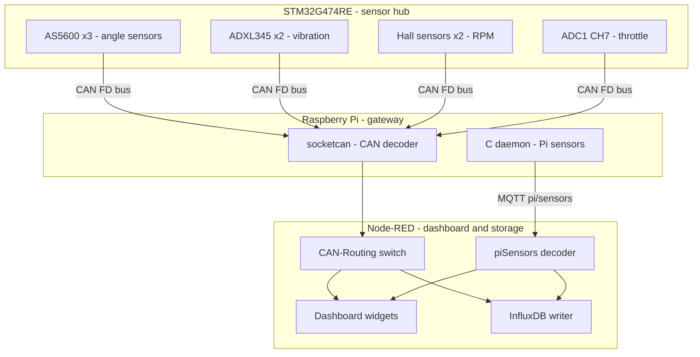
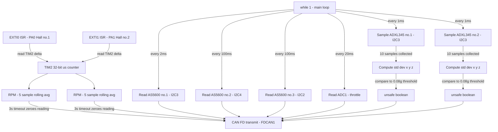
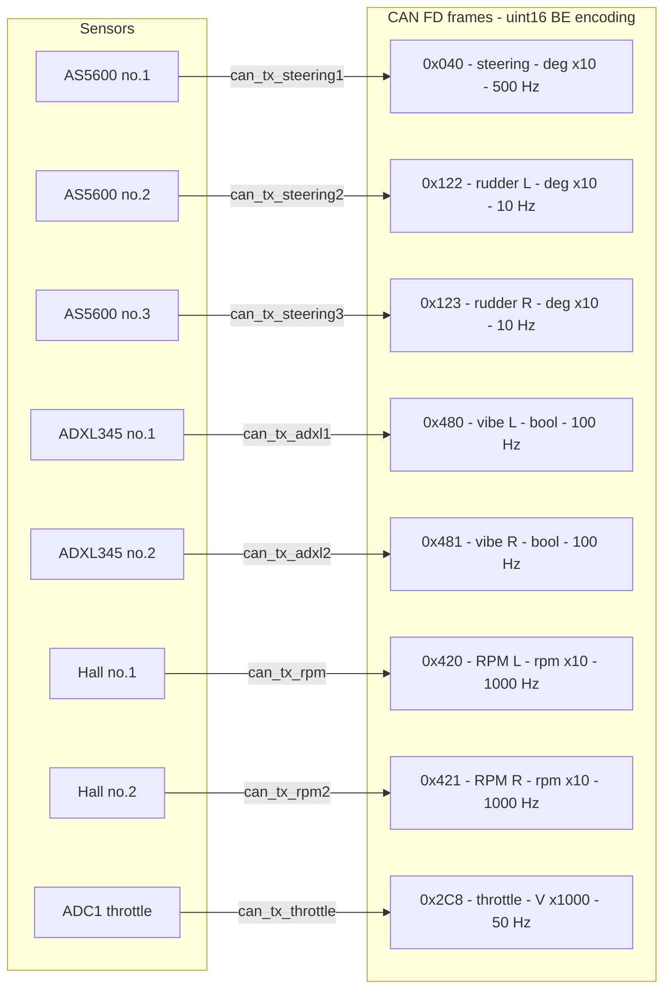
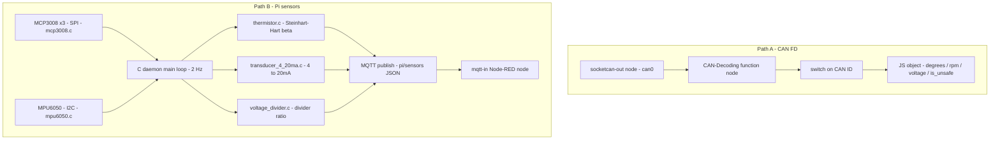
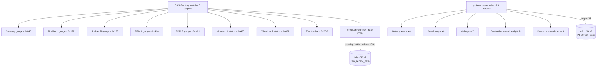
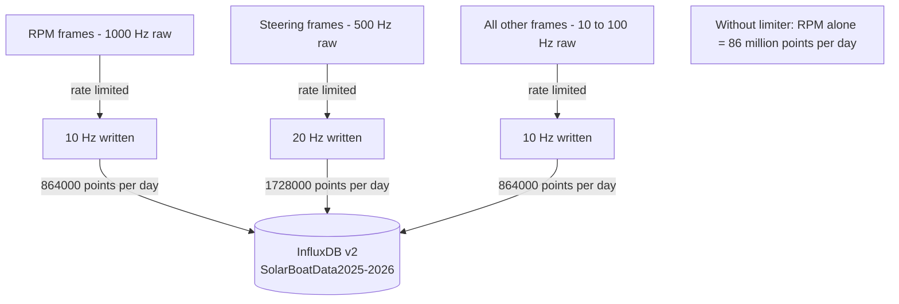

# Solar Boat Telemetry System

A three-layer real-time telemetry system for a solar boat. Raw physical signals are acquired on an STM32G474RE microcontroller, transmitted over CAN FD to a Raspberry Pi gateway, and fanned out into a live Node-RED dashboard and InfluxDB time-series database.

---

## Repository structure

```
├── STM32/
│   ├── main.c              # Sensor hub — scheduler, ISRs, sensor reads
│   ├── can_frames.c        # CAN FD frame builders and transmit functions
│   └── can_frames.h        # Frame ID map and function declarations
├── Pi/
│   ├── main.c              # C sensor daemon — MCP3008, MPU6050, MQTT publish
│   ├── mcp3008.c           # SPI driver for MCP3008 ADC
│   ├── mpu6050.c           # I2C driver for MPU6050 IMU
│   ├── thermistor.c        # Steinhart-Hart beta model temperature conversion
│   ├── transducer_4_20ma.c # 4-20mA current loop to engineering units
│   └── voltage_divider.c   # Voltage divider ADC to real voltage conversion
├── NodeRED/
│   └── flows.json          # Node-RED flows — CAN decode, dashboard, InfluxDB
└── README.md
```

---

## System overview



---

## Layer 1 — STM32G474RE sensor hub (`STM32/main.c` + `STM32/can_frames.c`)

The main loop uses a non-blocking `HAL_GetTick()` timestamp pattern. Each sensor has its own `last_tick_*` variable and fires independently when its interval elapses. There are no RTOS tasks or DMA — everything runs cooperatively in a single `while(1)`.

The Hall RPM path is the only genuinely interrupt-driven path. It runs entirely outside the main loop via `EXTI0` and `EXTI1` ISRs so motor speed measurement is never blocked by I2C reads.

### Scheduling model



### Sensor interface table

| Sensor | Interface | Signal | Rate |
|---|---|---|---|
| AS5600 #1 | I2C3 · 0x36 | Steering angle | 500 Hz |
| AS5600 #2 | I2C4 · 0x36 | Left rudder position | 10 Hz |
| AS5600 #3 | I2C2 · 0x36 | Right rudder position | 10 Hz |
| ADXL345 #1 | I2C3 · 0xA6 | Motor 1 vibration | 100 Hz (10 samples, 1 ms each) |
| ADXL345 #2 | I2C3 · 0x3A | Motor 2 vibration | 100 Hz (same pattern) |
| Hall sensor #1 | PA0 · EXTI0 | Left motor RPM | ISR-driven (1000 Hz TX) |
| Hall sensor #2 | PA1 · EXTI1 | Right motor RPM | ISR-driven (1000 Hz TX) |
| ADC1 · CH7 | PC1 | Throttle (0–3.3 V) | 50 Hz |

### CAN FD frame map (`STM32/can_frames.c`)

All frames are built and transmitted in `can_frames.c`. Each function receives a sensor value, packs it big-endian into a byte array, and calls `HAL_FDCAN_AddMessageToTxFifoQ`. TX failures print a UART message but do not call `Error_Handler` — the main loop always continues regardless of CAN bus status.



**Encoding examples from `can_frames.h`:**

| Signal | Scaling | Example |
|---|---|---|
| Angle (degrees) | `deg * 10` as `uint16` | 270.5° → 2705 → `[0x0A, 0x91]` |
| RPM | `rpm * 10` as `uint16` | 123.4 RPM → 1234 → `[0x04, 0xD2]` |
| Voltage | `voltage * 1000` as `uint16` | 2.500 V → 2500 → `[0x09, 0xC4]` |
| Vibration | 1-byte boolean | 0 = safe, 1 = unsafe |

### Vibration processing

The ADXL345 sensors accumulate 10 samples into a rolling buffer at 1 ms intervals (controlled by `ADXL_SAMPLE_INTERVAL_MS = RATE_MOTOR_VIBRATION_MS / ADXL_SAMPLES`). On every 10th sample the standard deviation of each axis is computed and compared to `ADXL_THRESH = 0.08g`. The result is a single `uint8_t` boolean transmitted via `can_tx_adxl1` / `can_tx_adxl2`. This deliberately decouples the 1 ms sampling rate from the 10 ms reporting rate — high-frequency events are captured without flooding the CAN bus.

### RPM measurement

Hall sensor edges trigger `HAL_GPIO_EXTI_Callback` on `PA0` and `PA1`. Each ISR reads TIM2's free-running 32-bit counter (170 MHz / prescaler 169 ≈ 1 MHz), computes the pulse-to-pulse period, derives RPM, and maintains a 5-sample rolling average in `rpm_1_buffer` / `rpm_2_buffer`. A 3-second timeout (`RPM_TIMEOUT = 3000000` microseconds) zeroes the reading if no pulse arrives. A minimum pulse gap of 5000 ticks debounces mechanical noise. RPM is then transmitted via `can_tx_rpm` / `can_tx_rpm2`.

---

## Layer 2 — Raspberry Pi gateway (`Pi/`)

Two independent data paths run in parallel.



**Path A — CAN FD:** The `socketcan-out` Node-RED node reads raw frames from `can0`. The `CAN-Decoding` function node switches on the CAN ID and deserialises each frame into a structured JavaScript object with named fields (`degrees`, `rpm`, `voltage`, `is_unsafe`). The decoded object is broadcast via `link out` nodes to both the dashboard and InfluxDB flows.

**Path B — Pi sensors:** The C daemon (`Pi/main.c`) runs a 2 Hz loop reading three MCP3008 ADCs over SPI (`mcp3008.c`) and an MPU6050 IMU over I2C (`mpu6050.c`). Sensor values are converted using dedicated modules:

| Module | Input | Conversion | Output |
|---|---|---|---|
| `thermistor.c` | ADC counts | Steinhart-Hart β model | Temperature °C |
| `transducer_4_20ma.c` | ADC counts | V / shunt → mA → engineering units | Pressure PSI |
| `voltage_divider.c` | ADC counts | Vnode × (R_top + R_bot) / R_bot | Real voltage V |
| `mpu6050.c` | Raw I2C registers | accel / 16384 · gyro / 131 | g and dps |

All values are serialised into a single JSON string and published to MQTT topic `pi/sensors` via libmosquitto. A `mqtt-in` Node-RED node subscribes and feeds the data downstream.

---

## Layer 3 — Node-RED dashboard and storage (`NodeRED/flows.json`)



**Dashboard routing.** The `CAN-Routing` switch node inspects `msg.payload.signal` and fans the stream to eight dedicated UI widgets — half-gauges for the three angle signals and both RPM signals, Vue template components for the two vibration status indicators (green/red), and a vertical bar template for throttle voltage.

**Pi sensor decoding.** The `piSensors` function node parses the JSON payload published by the C daemon and emits 28 separate output messages wired to `ui-text` nodes for temperatures, pressures, voltages, and IMU values. Output 28 is a pre-formatted Stackhero InfluxDB write message.

**Notable dashboard components:**
- Battery bar — SVG `clip-path` scaled by `msg.payload` percentage, tri-colour fill (red → amber → green)
- Boat attitude indicator — artificial horizon driven by real IMU roll/pitch from `mpu6050.c`, SVG `rotate()` and `translate` applied reactively via Vue watchers

### InfluxDB write rate limiting



The `PrepCanForInflux` function node applies per-signal rate limiting using node context timestamps. Pi sensor data is written under a separate measurement `PI_sensor_data` tagged with `device: raspberry_pi` and `source: c_program`.

---

## Key design decisions

| Decision | Reason |
|---|---|
| Non-blocking `HAL_GetTick()` scheduler | No RTOS needed — sensors fire independently without blocking each other |
| Hall RPM via EXTI ISR not main loop | Guarantees microsecond-accurate pulse timing regardless of I2C bus load |
| ADXL 10-sample buffer before reporting | Decouples 1 ms sampling from 10 ms CAN TX — captures events without flooding the bus |
| `uint16_t` ×10 / ×1000 fixed-point encoding in `can_frames.c` | Avoids floating point in CAN payloads while preserving one decimal place of precision |
| CAN TX failures print not Error_Handler | Main loop always continues — a busy CAN bus does not halt the sensor hub |
| Separate modules for each Pi sensor type | `thermistor.c`, `transducer_4_20ma.c`, `voltage_divider.c` are independently testable |
| MQTT for Pi sensor data | Decouples the C daemon from Node-RED — either can restart independently |
| InfluxDB write-rate limiter in node context | Reduces 86M points/day to ~864K points/day for RPM without losing dashboard resolution |
